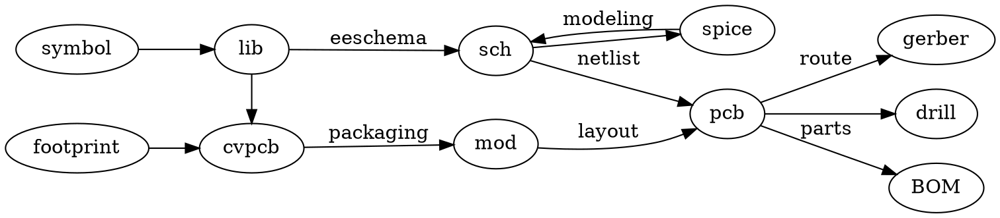

# маршрут проектирования печатной платы
#KiCAD #PCB

![[pathway.png]]

- [[symbol]] схемотехническое обозначение элемента схемы
	- [[lib]] библиотека символов
- [[footprint]] физический корпус и посадочное место
	- [[cvpcb]] программа для привязки [[symbol]]/[[footprint]] 
		- [[mod]] библиотека модулей (упаковка корпусов)
- [[eeschema]] редактор схем
	- [[SPICE]] = [[ngspice]] симулятор для расчёта схем
- [[pcbnew]] редактор печатной платы
	- [[Gerber]] промышленный формат для слоёв печатной платы (роутинг)
	- [[drill]] файлы сверловки
	- [[BOM]] Bill Of Materials: список использованных компонентов для постащиков и склада
	- [[placement]] данные координат/ориентации для машин автоматической установки компонентов

## основной flow

> схема -> печатная плата -> файлы для производства

Самый простой сценарий: 
- запускаете [[KiCAD]], 
- рисуете в нём [[eeschema|схему]] из журнала
- схему отправляете в [[pcbnew|редактор печатных плат]]
- [[трассировка|трассируете плату]] в 1-2 слоя
- наносите разводку платы на [[стеклотекстолит]] методом [[ЛУТ]]
- отправляете плату с нанесённой [[маска|маской]] травиться в [[хлорное железо]] или [[медный купорос]]
- берёте [[BOM]] и подбираете компоненты для монтажа
- [[монтаж]] и [[пайка]]
- [[отладка схемы]]
- [[написание прошивки]]
